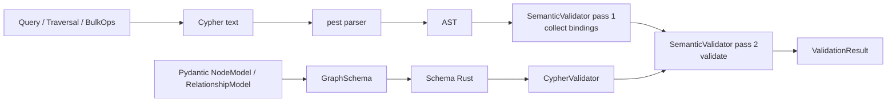

# Architecture

A walk-through of the codebase as it sits on disk. If you only want to know
*how to use* `cypher_validator`, the [Quickstart](../quickstart.md) is faster.
This page is for contributors who want to know where things live and why.

## Two halves

```text
┌────────────────────────────────── Python ──────────────────────────────────┐
│  cypher_validator/__init__.py                                              │
│  cypher_validator/models.py            ← Pydantic ORM, Query builder       │
│  cypher_validator/llm_pipeline.py      ← LLMNLToCypher + TokenBucket       │
│  cypher_validator/llm_utils.py         ← extract / repair / format helpers │
│  cypher_validator/rag.py               ← GraphRAGPipeline                  │
│  cypher_validator/gliner2_integration.py ← GLiNER2 / Neo4jDatabase / NER   │
└─────────────────────────┬──────────────────────────────────────────────────┘
                          │  pyo3 bindings
┌─────────────────────────▼──────────────────────────────────────────────────┐
│                          Rust core (cdylib)                                │
│  src/lib.rs              ← `#[pymodule] fn _cypher_validator`              │
│  src/bindings/py_*.rs    ← Schema / Validator / Generator / parse_query    │
│  src/parser/             ← pest grammar + AST + builder                    │
│  src/grammar/cypher.pest ← 312-line PEG                                    │
│  src/validator/semantic.rs ← two-pass semantic validator                   │
│  src/generator/mod.rs    ← 13 query-type templates                         │
│  src/schema/mod.rs       ← HashMap + HashSet-backed schema                 │
│  src/diagnostics.rs      ← error codes + Suggestion struct                 │
│  src/error.rs            ← top-level Error enum                            │
└────────────────────────────────────────────────────────────────────────────┘
```

The Python side **never** parses Cypher directly. Every validation goes
through the PyO3 boundary into Rust, gets parsed by pest, validated by the
semantic walker, and returns a `ValidationResult`. The ORM and LLM pipelines
sit above that boundary.

## Rust core

### `src/lib.rs` (25 lines)

The PyO3 module init. Registers five types and one function:

```rust
#[pymodule]
fn _cypher_validator(m: &Bound<'_, PyModule>) -> PyResult<()> {
    m.add_class::<PySchema>()?;
    m.add_class::<PyCypherValidator>()?;
    m.add_class::<PyValidationResult>()?;
    m.add_class::<PyValidationDiagnostic>()?;
    m.add_class::<PyCypherGenerator>()?;
    m.add_class::<PyQueryInfo>()?;
    m.add_function(wrap_pyfunction!(parse_query, m)?)?;
    Ok(())
}
```

### `src/parser/`

- `mod.rs` re-exports the parser entry points.
- `ast.rs` defines the `Query`, `Clause`, `Pattern`, `Expr` enums — the
  intermediate representation the builder produces.
- `builder.rs` (1 094 lines) walks pest `Pairs` into the typed AST. This is
  the largest single Rust file in the project — every Cypher clause has a
  dedicated `build_xxx` function. The big win lately was threading
  `labels_used` / `rel_types_used` through `collect_expr` so subqueries,
  pattern comprehensions, `shortestPath`, and `reduce` correctly populate
  `PyQueryInfo`.

### `src/grammar/cypher.pest`

312-line PEG grammar. Pest auto-derives the parser via `#[derive(Parser)]`
in the parser module. The grammar covers MATCH/CREATE/MERGE, OPTIONAL MATCH,
WHERE, WITH, RETURN, ORDER BY, SKIP/LIMIT, UNWIND, FOREACH, CALL subqueries,
DELETE/DETACH DELETE, SET/REMOVE, list comprehensions, pattern comprehensions,
existential subqueries, `shortestPath` / `allShortestPaths`, and `reduce`.

### `src/validator/`

- `mod.rs` — `CypherValidator` struct + the public `validate` and
  `validate_batch` methods. `validate_batch` releases the GIL via
  `Python::allow_threads` and uses `rayon::par_iter` to fan out across cores.
- `semantic.rs` (1 147 lines) — the **two-pass semantic validator**:

  **Pass 1 — collect bindings.** Walks every clause and records every node
  variable (with its labels) and relationship variable (with its rel type)
  into a `HashMap`. Uses `entry(...).get_mut() + .insert(...)` so we don't
  clone the labels `Vec` when a variable is already bound.

  **Pass 2 — validate.** Walks the AST again, this time checking every
  property access against the schema, every label / rel type against the
  registry, every variable reference against the collected bindings,
  aggregate scope rules, type compatibility, and pattern endpoint
  agreement.

  Errors are emitted with `E1xx-E6xx` codes plus optional `Suggestion`s
  from `diagnostics::closest_match`.

### `src/generator/mod.rs`

`CypherGenerator` produces synthetic queries for testing and few-shot LLM
prompts. 13 query-type templates: `match_return`, `match_where_return`,
`create`, `merge`, `aggregation`, `match_relationship`, `create_relationship`,
`match_set`, `match_delete`, `with_chain`, `distinct_return`, `order_by`,
`unwind`. The constructor precomputes `Vec<String>` of labels, rel_types, and
properties-by-label so generation is allocation-light.

### `src/schema/mod.rs`

The schema model. Backed by `HashMap<String, HashSet<String>>` for property
lookup — `Schema::has_property(label, prop)` is O(1). Earlier versions used
a `Vec<String>` here which was O(n) per check.

### `src/diagnostics.rs` (227 lines)

`ErrorCode` enum (`E101` through `E602` plus `W101`/`W201` warnings),
`Suggestion` struct (`{ kind, message, replacement }`), and the
`closest_match` Levenshtein lookup that powers "did you mean?" suggestions
and the validator's `fixed_query` auto-fix. The Levenshtein implementation
is `levenshtein_capped` — a 1-D rolling array (O(n) space) with
length-delta and row-min early exits.

### `src/error.rs`

Top-level `Error` enum, `thiserror`-derived.

### `src/bindings/`

One file per Python type:

- `py_schema.rs` — `PySchema` wraps `Schema` and exposes constructors,
  `has_label`, `has_property`, `to_cypher_context`, `to_dict`.
- `py_validator.rs` — `PyCypherValidator`, `PyValidationResult` (with
  `is_valid`, `errors`, `warnings`, `fixed_query`), `PyValidationDiagnostic`.
- `py_generator.rs` — `PyCypherGenerator` + `generate(query_type)`,
  `supported_types`.
- `py_parser.rs` — `PyQueryInfo` + the standalone `parse_query` function.
  After the recent fix, `collect_expr` threads `labels` and `rels` through
  every recursive call, so `info.labels_used` / `info.rel_types_used` are
  accurate even for `EXISTS { ... }`, `[(n)-->(m) WHERE ... | ...]`,
  `shortestPath((a)-[*]-(b))`, and `reduce(acc=0, x IN list | ...)`.

### `src/grammar/cypher.pest`

Standalone grammar file referenced from the parser module via
`#[derive(Parser)] #[grammar = "grammar/cypher.pest"]`.

## Python layer

### `python/cypher_validator/__init__.py`

The public API. Re-exports the Rust types from `_cypher_validator` and the
Python-layer ORM / LLM / NER classes from the modules below.

### `python/cypher_validator/models.py` (3 649 lines)

The Pydantic ORM. Houses `NodeModel`, `RelationshipModel`, the `_NodeMeta` /
`_RelMeta` registry-aware metaclasses, `GraphSchema`, the `Query` builder
(plus `Cond`, `CondGroup`, `RawExpr`, `PropExpr`, `NodeRef`, `RelRef`),
`Repository`, `BulkOps`, `Traversal`, `SchemaDDL`, `SchemaDiff`,
`GraphSession`, `AsyncGraphSession`, `AgentTools`, `ExtendedAgentTools`,
`QueryPlan` / `QueryStep` / `QueryResult`, `QueryHistory`, `CypherFn`,
`PathBuilder`, plus the `schema_to_pipeline_kwargs` shim into the LLM
pipeline.

### `python/cypher_validator/llm_pipeline.py` (1 798 lines)

`LLMNLToCypher` — sync + async NL → Cypher pipeline. Also defines the
`ChunkResult` / `IngestionResult` dataclasses and the
`TokenBucketRateLimiter` async limiter.

### `python/cypher_validator/llm_utils.py` (488 lines)

`extract_cypher_from_text`, `repair_cypher`, `cypher_tool_spec`,
`format_records`, `few_shot_examples`. All regex patterns are hoisted to
module scope (`_RE_FENCED_TAGGED`, `_RE_FENCED_ANY`, `_RE_BACKTICK`,
`_RE_CYPHER_LINE`) so the hot path doesn't pay the `re.compile` cost.

### `python/cypher_validator/rag.py` (251 lines)

`GraphRAGPipeline` — NL question → Cypher → execute → format → LLM
answer.

### `python/cypher_validator/gliner2_integration.py` (1 715 lines)

`Neo4jDatabase`, `EntityNERExtractor`, `GLiNER2RelationExtractor`,
`RelationToCypherConverter`, `NLToCypher`. Self-contained — no LLM
dependency.

## Data flow



The ORM never instantiates Rust types beyond the schema bridge. The
`Query.validate(schema)` call wraps `CypherValidator(schema).validate(cypher)`
under the hood.

## Dependency snapshot

From `Cargo.toml`:

| Crate | Version | Purpose |
|---|---|---|
| `pyo3` | 0.27.0 | Python bindings + GIL release. |
| `pest` / `pest_derive` | 2.8 | PEG grammar + auto-derive. |
| `serde` / `serde_json` | 1.0 | Schema serialisation. |
| `thiserror` | 2.0 | Error enum derivation. |
| `rand` | 0.9 | Query generator seeding. |
| `rayon` | 1 | `validate_batch` parallelism. |

Python runtime: **3.10+** (uses `X | Y` union syntax, `dataclass(slots=True)`).
Rust edition: **2024**.

!!! info "Why pest and not a hand-written parser?"
    pest produces structured `Pairs` from a single grammar file, which
    keeps the parser readable and the error positions exact. Performance
    is competitive with a hand-rolled recursive-descent parser — see
    [Performance](performance.md) for the numbers.

## GIL handling

The only Python-callable that releases the GIL is `validate_batch`:

```rust
fn validate_batch(&self, py: Python<'_>, queries: Vec<String>)
    -> PyResult<Vec<PyValidationResult>>
{
    py.allow_threads(|| {
        queries.par_iter().map(|q| self.validate(q)).collect()
    })
}
```

Single-query `validate()` keeps the GIL — the call is fast enough that
yielding wouldn't help and would add overhead.

## Where to next

- [Performance](performance.md) — numbers and the optimisations that got
  us there.
- [Testing](testing.md) — how to run the 1 039-test suite.
- [Contributing](contributing.md) — dev setup and commit conventions.
